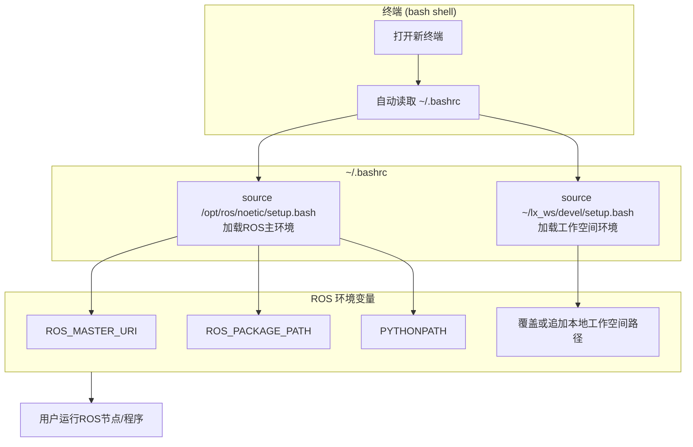

# 工作空间

工作空间（WorkSpace)是一个 **文件夹结构** ，用于 **组织、构建和管理 ROS 项目中的软件包** 。每个工作空间可以包含多个独立的包（packages），这些包之间可以相互依赖。它是 ROS 开发的基础环境，类似于其他编程语言中的“项目目录”。而在本次比赛中，我们将使用 **Catkin 工作空间** （基于 CMake 构建系统）。具体项目结构可以参考下图：



注： `build/` 和 `devel/` 目录是在你首次运行 `catkin_make` 或 `catkin build` 命令后自动生成的，不需要手动创建。 


## 优势

>   -   **标准化** ：让所有开发者遵循统一的项目结构。
>   -   **模块化** ：每个包独立，便于复用和管理。
>   -   **依赖管理** ：通过 `package.xml` 管理包之间的依赖关系。
>   -   **构建自动化** ：使用 `CMakeLists.txt` 和 Catkin 工具链自动编译代码。

---
# 工作空间常见文件与文件夹及其作用

## 工作空间根目录下的三个核心文件夹

### `src/` —— 源码目录

- **作用** ：存放所有 ROS 包（packages）的源代码。
- **内容** ：
  - 所有你自己创建或从别人那里克隆来的 ROS 包都放在这里。
  - 包含 `CMakeLists.txt` 、 `package.xml` 等配置文件。
  - 也包含 `.cpp` 、 `.py` 、 `.msg` 、 `.launch` 等实际代码文件。

**注意** ：不要手动修改 `build/` 和 `devel/` ，它们是构建过程自动生成的。



### `build/` —— 构建中间文件目录

- **作用** ：存放编译过程中生成的中间文件（如 Makefile、对象文件等）。
- **特点** ：
  - 由 `catkin_make` 或 `catkin build` 自动生成。
  - 不需要你手动编辑或管理。
  - 可以安全删除后重新构建。

###  `devel/` —— 开发环境输出目录

- **作用** ：存放编译后的可执行文件、库文件、脚本以及环境设置文件。

- **关键文件** ：
  
  - `setup.bash` / `setup.sh` / `setup.zsh` —— 设置当前终端环境变量（如 `ROS_PACKAGE_PATH` , `PYTHONPATH` ），让系统能找到你刚编译的包。
  

**重要命令** ：

```bash
source devel/setup.bash
```
这条命令必须在每次打开新终端后运行，才能使用你编译的包。


## 每个 ROS 包（如 `package2` ）内部的常见结构

### CMakeLists.txt

- **作用** ：CMake 构建系统的配置文件，告诉编译器如何编译你的代码。
- **内容包括** ：
  - 项目名称、版本
  - 需要的依赖库（如 `roscpp` , ` rospy` ）
  - 编译哪些源文件（ `.cpp` ）
  - 生成哪些可执行文件或库


类似于 Python 的 `setup.py` 或 C++ 项目的 `Makefile` 。



### package.xml

- **作用** ：包的元数据描述文件，定义包的基本信息和依赖关系。
- **内容包括** ：
  - 包名、版本、作者、许可证
  - 运行时依赖（ `<run_depend>` ）
  - 编译时依赖（ `<build_depend>` ）
  - 导出信息（如插件、消息类型等）


✅ **必须存在** ，否则 ROS 无法识别这个包。



类似于 Python 的 `requirements.txt` + `setup.py` 的结合体。



## 包内的功能子目录

### scripts/
- **作用** ：存放可直接运行的脚本文件（通常是 Python 或 Shell 脚本）。
- **文件扩展名** ：
  - `.py` —— Python 脚本（常用）
  - `.sh` —— Shell 脚本（用于启动程序、设置环境等）

这些脚本可以直接在终端运行（需赋予执行权限）：
```bash
chmod +x scripts/my_script.py
./scripts/my_script.py
```



### msg/

- **作用** ：存放自定义的 **消息（Message）** 定义文件。
- **文件扩展名** ： `.msg`
- **示例** ：
  ```plaintext
  # MyMessage.msg
  int32 id
  string name
  float64[] scores
  ```
- 用于在不同节点之间传递结构化数据。不同的package之间可以通过msg及其文件来沟通，交换数据。每个package相互独立，又彼此沟通。


使用前需在 `CMakeLists.txt` 和 `package.xml` 中声明并生成代码。



###  srv/

- **作用** ：存放自定义的 **服务（Service）** 定义文件。
- **文件扩展名** ： `.srv`
- **结构** ：分为请求（request）和响应（response）两部分。
- **示例** ：
  ```plaintext
  # AddTwoInts.srv
  int32 a
  int32 b
  ---
  int32 sum
  ```
- 用于实现“请求-响应”式通信（如调用一个服务计算两个数之和）。

使用前同样需在 `CMakeLists.txt` 声明并生成代码。



###  include/

- **作用** ：存放 C++ 头文件（ `.h` 或 `.hpp` ）。
- **用途** ：
  - 声明类、函数、常量等供其他 `.cpp` 文件引用。
  - 通常与 `src/` 目录配合使用。
-  在 `CMakeLists.txt` 中通过 `include_directories()` 告诉编译器头文件位置。


###  src/（包内的 src）

- **作用** ：存放 C++ 源代码文件（ `.cpp` ）。
- **用途** ：
  - 实现节点的主要逻辑。
  - 通常会包含 `main()` 函数，作为可执行程序的入口。

必须在 `CMakeLists.txt` 中用 `add_executable()` 和 `target_link_libraries()` 注册才能编译。



### launch/

- **作用** ：存放 **启动文件（Launch Files）** ，用于一次性启动多个节点、设置参数、加载机器人模型等。
- **文件扩展名** ： `.launch`
- **语言** ：XML 格式。
- **示例** ：
  
  ```xml
  <launch>
    <node name="talker" pkg=" beginner_tutorials" type="talker.py"/>
    <node name="listener" pkg="beginner_tutorials" type="listener.py"/>
  </launch>
  ```


使用方式：
```bash
roslaunch my_package my_launch_file.launch
```



## 各文件/目录功能速查表

| 文件/目录        | 类型 | 功能说明                                 |
| ---------------- | ---- | ---------------------------------------- |
| `src/`           | 目录 | 存放所有 ROS 包的源代码                  |
| `build/`         | 目录 | 编译中间文件，自动生成                   |
| `devel/`         | 目录 | 编译后输出，包含可执行文件和环境设置脚本 |
| `CMakeLists.txt` | 文件 | CMake 构建配置，控制如何编译代码         |
| `package.xml`    | 文件 | 包的元数据，声明依赖、作者、版本等       |
| `scripts/`       | 目录 | 存放可执行脚本（Python/Shell）           |
| `msg/`           | 目录 | 自定义消息定义（.msg）                   |
| `srv/`           | 目录 | 自定义服务定义（.srv）                   |
| `include/`       | 目录 | C++ 头文件（.h）                         |
| `src/` （包内）   | 目录 | C++ 源代码文件（.cpp）                   |
| `launch/`        | 目录 | 启动文件（.launch），用于批量启动节点    |

## 后记

- 所有这些文件和目录都是 **约定俗成的标准结构** ，遵循它能让你的代码更容易被他人理解和复用。
- 初学者建议先从官方教程（如 `ros_tutorials` ）开始，观察标准包的结构。
- 使用 `catkin_create_pkg` 命令可以快速创建符合规范的新包：
  ```bash
  cd ~/catkin_ws/src
  catkin_create_pkg my_package rospy std_msgs geometry_msgs
  ```

---
# 创建一个工作空间

## 创建工程根目录

### 方法一：分层创建

首先在系统主文件夹或任意一个你可以全局运行代码的路径下，使用 `mkdir` 来创建工程根目录，此处我以主文件夹下创建为例，在主文件夹下运行以下命令：

```bash
mkdir Tika_ws
```

此时，主文件夹下便出现一个名为Tika_ws的文件夹，之后的工程都是基于这个文件夹为根目录，故称为工程根目录

接下来进入该文件夹

```bash
cd Tika_ws
```

进入之后我们创建存放ROS源代码的 `src` 文件夹

```bash
mkdir src
```

此时我们的工程根目录创建完毕

### 方法二：多层一次创建

首先在系统主文件夹或任意一个你可以全局运行代码的路径下，使用 `mkdir` 来创建工程根目录，此处我以主文件夹下创建为例，在主文件夹下运行以下命令：

```bash
mkdir -p Tika_ws/src
```

此时我们Tika_ws和src便可以一次创建


多层建设必须要加入 `-p` 参数


---

# 声明工作空间

## 命令

我们需要在工程根目录下src（Tika_ws/src）路径下运行以下命令以声明工作空间

```bash
catkin_init_workspace
```

## 工作原理

这个命令会：

-   在 `src/` 目录下生成一个 **`CMakeLists.txt` 文件** （实际上是一个指向 Catkin 系统 CMake 文件的符号链接）。
-   这个 `CMakeLists.txt` 的作用是告诉 CMake：“这个目录下包含多个 ROS 包，请遍历所有子目录并构建它们”。

>   生成的 `CMakeLists.txt` 内容类似于： 
>
>     ```cmake
>     /opt/ros/noetic/share/catkin/cmake/toplevel.cmake
>     ```

这样，当你回到工作空间根目录运行 `catkin_make` 时，CMake 就知道如何处理整个 `src/` 目录下的包。

## 补充

从 **ROS Kinetic（2016 年）之后的版本开始** ， `catkin_make` 命令已经 **内置了自动初始化功能** 。也就是说：

> **只需要这样做即可：**
> 
> ```bash
> mkdir -p ~/Tika_ws/src
> cd ~/Tika_ws
> catkin_make
> ```
> 

`catkin_make` 会自动检测 `src/` 是否为空，并在必要时自动完成 `catkin_init_workspace` 的工作（即生成顶层 `CMakeLists.txt` ）。


这样做的前提是：ROS 版本是 **Kinetic、Melodic 或 Noetic** （ROS Hydro / Indigo（较老版本不适用）；Kinetic 及以后可省略）


---
# 编译

## 命令

我们需要在项目更目录（Tika_ws）文件夹下运行如下命令：

```bash
catkin_make
```


## 作用

-   编译 `src/` 目录下的所有 ROS 包；
-   在 `build/` 目录中生成编译中间文件；
-   在 `devel/` 目录中生成可执行文件和环境配置。

## 后续

**使新构建的包生效** （每次打开新终端都需要）：
   ```bash
   source devel/setup.bash
   ```

## **常用选项**

- **只编译某个特定包** ：
  ```bash
  catkin_make --pkg 包名
  ```

- **显示详细编译信息（调试用）** ：
  ```bash
  catkin_make VERBOSE=1
  ```

- **使用多线程加速编译** （例如使用 4 个 CPU 核心）：
  ```bash
  catkin_make -j4
  ```

- **清理编译结果** （重新编译前可选）：
  ```bash
  catkin_make clean
  ```

## **首次创建工作空间**

如果你是第一次创建 Catkin 工作空间：

```bash
mkdir -p ~/Tika_ws/src
cd ~/Tika_ws
catkin_make
source devel/setup.bash
```


**建议** ：将环境变量自动加载到终端中，避免每次手动 `source` ：

```bash
echo "source ~/Tika_ws/devel/setup.bash" >> ~/.bashrc
source ~/.bashrc
```



## **常见问题排查**

- **提示 `catkin_make: command not found`**  
  说明 ROS 环境未正确配置。请先运行：
  ```bash
  source /opt/ros/你的ROS版本/setup.bash
  # 例如：source /opt/ros/noetic/setup.bash（Ubuntu 20.04 + ROS Noetic）
  ```

- **编译报错（如缺少依赖）**  
  可使用 `rosdep` 自动安装依赖：
  ```bash
  rosdep install --from-paths src --ignore-src -r -y
  ```

- **修改了 CMakeLists.txt 或 package.xml 后不生效**  
  通常需要重新运行 `catkin_make` ，有时需先清理：
  ```bash
  catkin_make clean
  catkin_make
  ```

---

# 创建功能包

## 命令

在根目录源代码文件夹下（Tika_ws/src）文件夹下运行如下命令即可创建一个名为 `name_pkg` 的功能包，同时该包依赖为 `msgs rospy roscpp`

```bash
catkin_create_pkg name_pkg std_msgs rospy roscpp
```

## 参数解析

-   **`catkin_create_pkg`**
     创建一个新的 catkin 功能包。
-   **`name_pkg`**
     你要新建的包的名字（包名必须是小写字母、数字和下划线，不能有大写字母）。
-   **`std_msgs` `rospy` `roscpp`**
     表示这个新包在 `package.xml` 和 `CMakeLists.txt` 里会声明对这些依赖的需求。
    -   `std_msgs` ：标准消息类型包
    -   `rospy` ：Python 版 ROS 客户端库
    -   `roscpp` ：C++ 版 ROS 客户端库

## 运行流程

运行命令后，会在当前目录下生成一个名为 `Name_pkg` 的文件夹，里面包括：

1.  **`CMakeLists.txt`**
     编译配置文件，会自动写好依赖。
2.  **`package.xml`**
     包的描述文件（包名、依赖、作者等）。
3.  **`src/` 文件夹**
     放源代码。
4.  **`include/` 文件夹**
     （如果需要）放头文件。

## 文件结构

运行之后的文件结构树大致如下，有package.xml与CMakeLists.txt才能表示创建成功

```bash
name_pkg
        ├── CMakeLists.txt
        ├── include
        │   └── test_pkg
        ├── package.xml
        └── src

3 directories, 2 files
```


## 补充依赖

### 需要补充依赖的两个地方

#### **package.xml**

这是 ROS 包的“说明书”，里面列出依赖。
 找到 `<depend>` 标签位置，添加缺失的依赖，比如要加 `sensor_msgs` ：

```xml
<depend>sensor_msgs</depend>
```

常见依赖写法：

```xml
<depend>std_msgs</depend>
<depend>geometry_msgs</depend>
<depend>rospy</depend>
<depend>roscpp</depend>
```


####  **CMakeLists.txt**

这是编译配置文件。
 找到 `find_package(catkin REQUIRED COMPONENTS ...)` 那一行，把依赖加进去：

```cmake
find_package(catkin REQUIRED COMPONENTS
  roscpp
  rospy
  std_msgs
  sensor_msgs
)
```

如果你需要用到消息依赖，还要在 `catkin_package()` 里加上：

```cmake
catkin_package(
  CATKIN_DEPENDS roscpp rospy std_msgs sensor_msgs
)
```

### **重新编译**

修改完后，回到工作空间根目录：

```bash
cd ~/Tika_ws
catkin_make
```

编译成功后，别忘了刷新环境变量：

```bash
source devel/setup.bash
```

### 前后比对

#### package.xml

##### 修改前

```xml
<package format="2">
  <name>my_robot</name>
  <version>0.0.0</version>
  <description>The my_robot package</description>

  <maintainer email="you@todo.todo">your_name</maintainer>
  <license>TODO</license>

  <buildtool_depend>catkin</buildtool_depend>

  <build_depend>roscpp</build_depend>
  <build_depend>rospy</build_depend>
  <build_depend>std_msgs</build_depend>

  <build_export_depend>roscpp</build_export_depend>
  <build_export_depend>rospy</build_export_depend>
  <build_export_depend>std_msgs</build_export_depend>

  <exec_depend>roscpp</exec_depend>
  <exec_depend>rospy</exec_depend>
  <exec_depend>std_msgs</exec_depend>
</package>
```


##### 修改后（补充 sensor_msgs）

```xml
<package format="2">
  <name>my_robot</name>
  <version>0.0.0</version>
  <description>The my_robot package</description>

  <maintainer email="you@todo.todo">your_name</maintainer>
  <license>TODO</license>

  <buildtool_depend>catkin</buildtool_depend>

  <build_depend>roscpp</build_depend>
  <build_depend>rospy</build_depend>
  <build_depend>std_msgs</build_depend>
  <build_depend>sensor_msgs</build_depend>

  <build_export_depend>roscpp</build_export_depend>
  <build_export_depend>rospy</build_export_depend>
  <build_export_depend>std_msgs</build_export_depend>
  <build_export_depend>sensor_msgs</build_export_depend>

  <exec_depend>roscpp</exec_depend>
  <exec_depend>rospy</exec_depend>
  <exec_depend>std_msgs</exec_depend>
  <exec_depend>sensor_msgs</exec_depend>
</package>
```

####  CMakeLists.txt

##### 修改前

```cmake
cmake_minimum_required(VERSION 3.0.2)
project(my_robot)

find_package(catkin REQUIRED COMPONENTS
  roscpp
  rospy
  std_msgs
)

catkin_package(
  CATKIN_DEPENDS roscpp rospy std_msgs
)
```

##### 修改后（补充 sensor_msgs）

```cmake
cmake_minimum_required(VERSION 3.0.2)
project(my_robot)

find_package(catkin REQUIRED COMPONENTS
  roscpp
  rospy
  std_msgs
  sensor_msgs
)

catkin_package(
  CATKIN_DEPENDS roscpp rospy std_msgs sensor_msgs
)
```

---

# 配置文件 .bashrc

##  .bashrc 的基本作用

-   位置： `~/.bashrc` （ `~` 就是你的 home 目录）
-   作用： **每次启动一个新的 bash 终端时** ，这个文件里的命令都会被执行。
-   常见用途：
    1.  设置环境变量（比如 PATH、ROS 环境）
    2.  定义别名（alias）
    3.  设置终端颜色/提示符

##  和 ROS 的关系

在 ROS 中，你安装或编译工作空间后，需要让系统知道 ROS 的路径。
 通常会在 `.bashrc` 的最后加一句：

```bash
source /opt/ros/noetic/setup.bash         # ROS 主环境
source ~/lx_ws/devel/setup.bash           # 你的工作空间环境
```

这样，每次打开终端，ROS 的环境变量都会自动加载，不用你手动 `source` 一遍。


##  查看与编辑

-   **查看：**

```bash
cat ~/.bashrc
```

-   **编辑：**

```bash
gedit ~/.bashrc
```

或者用 nano：

```bash
nano ~/.bashrc
```

-   **修改后生效：**

```bash
source ~/.bashrc
```

## ROS 工作空间和 .bashrc 的关系


---

# launch文件

##  什么是 launch 文件？

-   后缀： `.launch`
-   格式： **XML**
-   功能：批量启动 ROS 节点、设置参数、加载配置
-   用途：
    -   一次性启动多个节点
    -   设置参数服务器的值
    -   指定命名空间和重映射话题
    -   更方便的实验和项目管理

相当于 **一键启动脚本** 。

##  基本结构

launch 文件放在功能包（package）的 `launch/` 文件夹里。
 一个最小例子：

```xml
<launch>
  <!-- 启动 talker 节点 -->
  <node pkg="roscpp_tutorials" type="talker" name="talker_node" output="screen"/>

  <!-- 启动 listener 节点 -->
  <node pkg="roscpp_tutorials" type="listener" name="listener_node" output="screen"/>
</launch>
```

## 常用标签说明

1.  **`<node>`**

    -   启动一个节点
    -   参数：
        -   `pkg` ：功能包名字
        -   `type` ：节点可执行文件名
        -   `name` ：节点运行时的名字
        -   `output="screen"` ：日志打印到终端

    示例：

    ```xml
    <node pkg="my_robot" type="move_base" name="move_base_node" output="screen"/>
    ```

2.  **`<param>`**

    -   设置参数服务器里的参数

    ```xml
    <param name="robot_speed" value="1.0" type="double"/>
    ```

3.  **`<rosparam>`**

    -   从 YAML 文件加载参数

    ```xml
    <rosparam file="$(find my_robot)/config/robot.yaml" command="load"/>
    ```

4.  **`<arg>`**

    -   定义变量，可以在运行 `roslaunch` 时传入

    ```xml
    <arg name="use_sim_time" default="true"/>
    <param name="use_sim_time" value="$(arg use_sim_time)"/>
    ```

5.  **`<include>`**

    -   包含另一个 launch 文件

    ```xml
    <include file="$(find my_robot)/launch/sensors.launch"/>
    ```

6.  **`<group>`**

    -   分组并设置命名空间

    ```xml
    <group ns="robot1">
       <node pkg="my_robot" type="controller" name="controller1"/>
    </group>
    ```


##  示例
###  代码示例

创建一个 `launch/` 文件夹（如果没有的话）：

```bash
cd ~/Tika_ws/src/my_robot   # 假设你的包叫 my_robot
mkdir launch
```

在里面新建 `turtle_demo.launch` ：

```xml
<launch>
  <!-- 启动小乌龟画图窗口 -->
  <node pkg="turtlesim" type="turtlesim_node" name="turtle_sim" output="screen"/>

  <!-- 启动键盘控制小乌龟 -->
  <node pkg="turtlesim" type="turtle_teleop_key" name="turtle_teleop" output="screen" launch-prefix="xterm -e"/>
</launch>
```

###  说明

-   `pkg="turtlesim"`
     表示节点来自 `turtlesim` 功能包（ROS自带）
-   `type="turtlesim_node"`
     小乌龟画图窗口节点
-   `type="turtle_teleop_key"`
     键盘控制节点
-   `launch-prefix="xterm -e"`
     强制在新终端打开键盘控制，不然你没法同时动键盘和看乌龟窗口。


如果你机器上没装 `xterm` ，先装一下：

```bash
sudo apt-get install xterm
```



###  启动方式

编译并运行：

```bash
cd ~/lx_ws
catkin_make
source devel/setup.bash
roslaunch my_robot turtle_demo.launch
```

你会看到：

1.  一个小乌龟窗口弹出来（乌龟在里面）
2.  另一个终端窗口运行 `turtle_teleop_key` ，你可以用键盘 `↑ ↓ ← →` 控制乌龟画图
